# Forecasting-operational-revenue-of-United-Airlines

For this project, data from United States Department of Transportation (Bureau of Transportation Statistics) has been used.  We will be considering the quarterly revenue of ‘United Airlines’ from 2000 to 2020 (2nd Quarter) for forecasting the revenue for the years 2020 and 2021 on a quarterly basis. The idea is to forecast the future revenue for the years 2020 and 2021. United Airlines, Inc. (commonly referred to as United) is a major American airline company and
is the 3rd largest Airline in the world. It operates a large domestic and international route network spanning city large and small across the United States and all six continents. It’s revenue for the year 2019 was 43.26 billion USD (as per ‘benzinga news’). The goal of our project is to study and implement the algorithms in order to forecast the future operating revenue for the ‘United Airlines’ using Time Series methodologies and deriving an optimal solution to help them in decision making for better revenue generation in future.

The following forecasting methodologies will be used to forecast the revenue for the UNITED Airlines.
1.	Linear and Quadratic Trend
2.	Naïve and Seasonal Naïve
3.	Two Level Model
4.	Holt Winters Model
5.	Auto ARIMA Model
6.	Auto regression Model with Linear Trend and Seasonality

**Introduction:**

**Company background:**

United Airline Inc. is a major American airline headquartered in Chicago Illinois. Founded initially as a mail service carrier airline with name of Varney Air Lines in 1926. 
United now operates a large domestic and international route network spanning city large and small across the United States and all six continents. Measured by fleet size and the number of routes, United has since grown to becoming the third leading airline worldwide. In 2019, United Airlines had the fourth highest domestic market share among U.S. airlines, accounting for roughly 15 percent of the market. Its main competitors are Southwest Airlines, American Airlines and Delta Air Lines. In the fiscal year of 2019, the number of passengers boarded by United Airlines amounted to more than 162.4 million revenue passengers. United generated over one billion U.S. dollars in revenue from passenger baggage fees in that year. The airline's parent company, United Continental Holdings, reported operating revenue of over 4.2 billion U.S. dollars in 2019 and the company is a founding member of the world's largest airline alliance, Star Alliance. In November 2020, United Airlines Holdings Inc. started manning flights to position shipments of Pfizer's COVID-19 vaccine in the event that the shots are approved by the FDA and other regulators worldwide. The Federal Aviation Administration has stated it will allow United shipments of 15,000 pounds of dry ice per flight, a measure taken to ensure the vaccine does not spoil, which is five times more than normally permitted.

**Problem Statement:**

We are considering United Airline’s quarterly revenue sales information for 20 years from 2000 to 2020(2nd Quarter) for forecasting the revenue for the years 2020 and 2021 on a quarterly basis. United Airlines (UAL) announced their second quarter 2020 financial results, the most difficult financial quarter in its 94-year history, with a net loss of $1.6 billion, and an adjusted net loss¹ of $2.6 billion. Total operating revenues were down 87.1% year-over-year, on an 87.8 percent decrease in capacity year-over-year. The company's total liquidity as of the close of business on Monday, July 20, 2020 was approximately $15.2 billion. United now expects liquidity at the end of the third quarter to be over $18 billion. This calls for better ways and techniques to forecast the revenue.

**Proposed Solution:**

With the current market facts and knowledge of Time Series Forecasting and Analytics, we would like to analyze the situation with the help of Time Series Forecasting models in R. This shall act as a proof of concept for similar situation in future.

The following models will be used for forecasting.
-	Regression based Model
This method will be used to capture the Trend, Seasonality and Autocorrelation which will help us create a robust prediction model.
-	2 Level Model (Regression + Trailing MA for Residuals)
This method considers window of k periods which are averaged based on data points from the past for a given point in time. Since its not dependent on the future values at a given point of time, it can be used for forecasting future values.
-	Holts Winters Model:
Using the most optimal smoothing parameters, this method will be used to evaluate all the possible combinations of Trend and Seasonality.
-	Arima Model
This model explains a given time series based on its own past values, that is, its own lags and the lagged forecast errors. Hence, using this method, forecast accuracy can be increased.
-	Auto Regressive Model
This model explains the future behavior based on past behavior. Hence this model can be used for forecasting correlation between values in a time series and the values that precede and succeed them.
 

**Eight Steps of Forecasting:**

**Step 1 – Define goal** 
The goal of our project is to create numeric forecasts of the ‘United Airline’s’ operating revenue for the four upcoming fiscal quarters. The objective is to select a predictive model from a pool of different time series models, in order to compare which model can be used as a best fit for this forecasting. Trend and Seasonal components both will be considered in this case of the historical data for future forecasting. Selection of the winning model/ best fit will be done based on the model accuracy values especially RMSE and MAPE values. These future forecasts will be helpful for the company to plan their future work well before hand so that the financial goals will be achieved.

**Step 2 – Get Data** 
The data is collected from the ‘Bureau of Transportation Statistics’ website managed by the United States Department of Transportation. The data focuses on quarterly operating revenue of the airlines form the 1st quarter of 2000 to 2nd quarter of 2020, all the values are considered for this given time frame to predict the operating revenue of the last two quarters (for 2020) and the first two quarters (for 2021) respectively.

**Step 3 - Explore and Visualize series** 
-	Firstly, we characterize the time series of this dataset 

     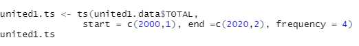
 
-	Then we use the plot function as follows:

    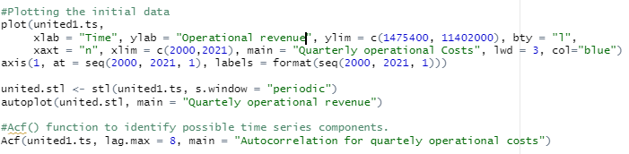
 
-	Visualizing the data plot can be done by using the plot function. The quarterly operations revenue is shown in the chart below:

    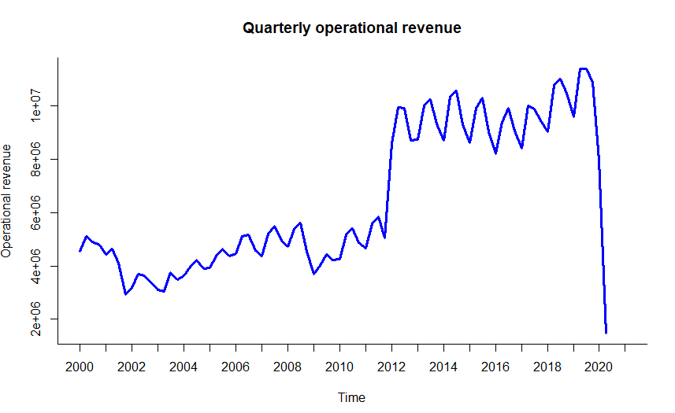

-	The data plot above shows the Operational cost on the left (Y-axis) and years on (X-axis).
-	As one can see the cost goes on increasing from 1st quarter to second quarter in 2000 and then there is slight decrease until the final quarter of 2001, then there is small upward trend from 2002 to year 2008 but then there is a sudden decline in the revenue in the final quarters of 2008 and initial quarters of 2009. There is again a sudden increase from 1st quarter of 2012 to approx. $860000 million.
-	From the year 2013, we can see some trend as the revenue increases in 1st two quarters and slightly decreases in 3rd and 4th quarter.
-	From the last quarter of 2019 until the final 2nd quarter of 2020 there is a very huge decline in the operational revenue, which is probably because of COVID 19.
-	The ACF chart for this entire dataset is shown below:

     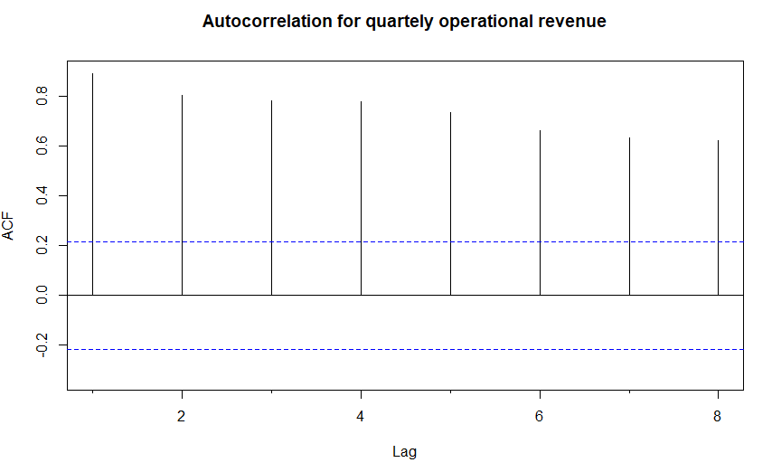

The autocorrelation coefficients in the above chart are higher than the threshold value for all the lags. In lag 1 the higher threshold indicates of an upward trend initially, all of these values are statistically significant and hence points towards seasonal component in the data.

**Step 4 - Pre-process data** 
The data that we have, has been provided by the United States Department of Transportation (Bureau of Transportation Statistics). Operational Revenue of United Airlines in all regions.

This is the initial snapshot of the data and as we can see the data contains all regions of operations (Domestic, Latin America, Atlantic, Pacific, International).

   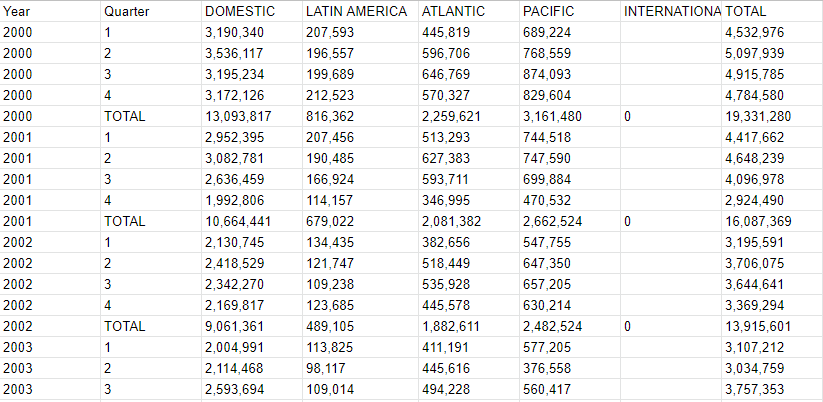

Part 1:
Omitting data which is not required for forecasting purposes:
-	The International column doesn't hold any data on operational revenue. 
-	The ''total'' column holds the summation of operational revenue of the individual regions, so the individual revenue columns are not needed for forecasting purposes, and hence have been dropped. 
-	There are certain rows that indicate the annual total (like line 5 provided in the above snapshot) that are not needed for computation, so these rows were also dropped. 
-	The preprocessed dataset is exported as a csv file under the name “unitedprepro”.
Part 2:
Pre-Processing in Excel:
-	The "Year" and the "Quarter" columns have been merged into 1 column and with respect to the ''Total" column the comma separators have been removed.

-	The snapshot of the final dataset that is going to be used for forecasting purposes is shown below:

   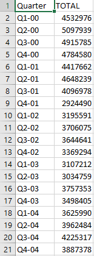
 

Step 5 - Partition series 
We created a data partition of 66 records for the training period and 16 records for validation period. 
-	The training partition holds the data for the years:
Quarter 1 of 2000 to Quarter 2 of 2016.
-	The validation partition holds the data for the years:
Quarter 3 of 2016 to quarter 2 of 2020  

The training Partition is shown below:

  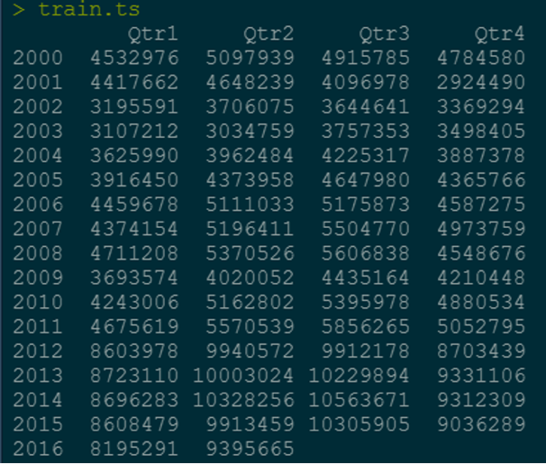
 
The Validation Partition is shown below:
  
  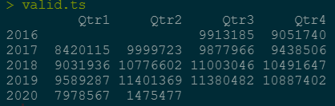
 
Step 6 - Applying forecasting methods 
Model 1: Linear and Quadratic Trend 

-	Equation for Regression model with linear trend is 
yt= 2434303 + 100268 t

   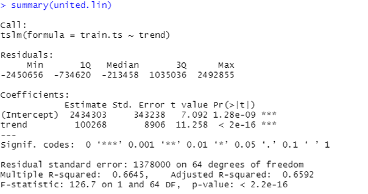
 

-	Equation for Regression model with quadratic trend is 
yt = 4465129.9 - 78922 t + 2674.5 t2

   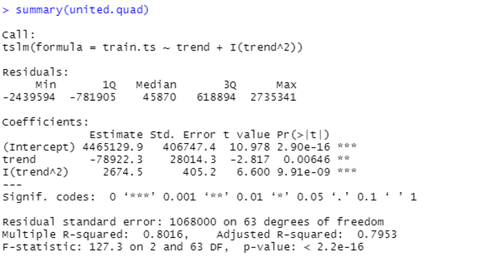
 
-	We have applied this basic model on training and validation dataset, the results are as shown above, the p-value in this case is very less than 0.2 for both the trend and the intercept, even though the R-squared values are close to 0.6 and 0.8 resp for linear and quad trend, this indicates that this is a good model.
-	The forecasting is applied on these models and results are shown below:

   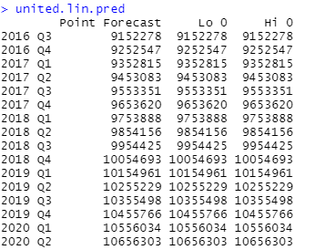
   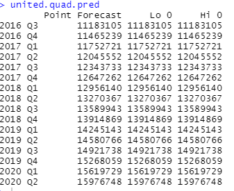
   
**Graphs**

Below graph shows the linear trend forecast on the entire dataset and how the linear trend forecast compares with the original data.

   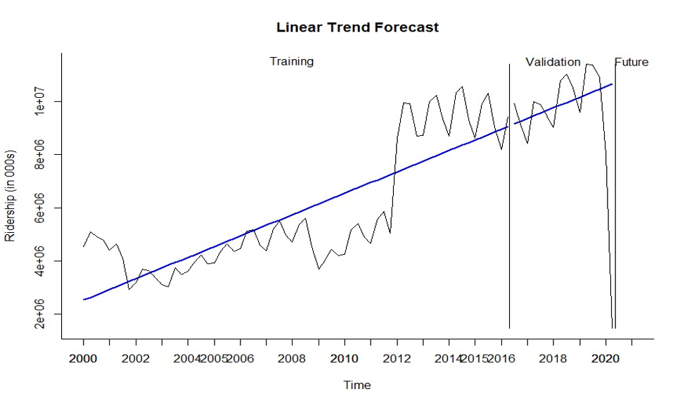   
 
Above graph shows the quadratic trend forecast on the entire dataset and how the quadratic trend forecast compares with the original data in training, validation and future data.

   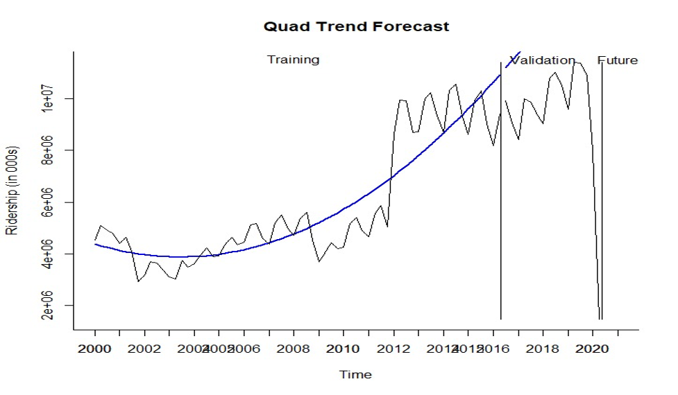
 

**Model 2: Naïve and Seasonal Naïve**

**Naïve:**
- The naïve model has a MAPE value of 9.70 % and RMSE value of 789420.7 on the training dataset which are the percentage of error and margin of error respectively.

   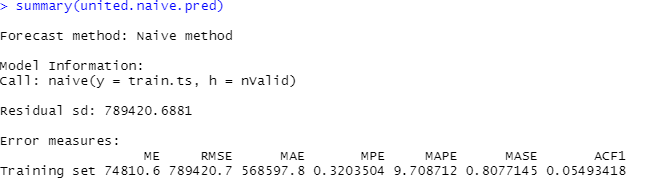
   
**Snaive:**
-	The snaive model has a MAPE value of 12.83 % and RMSE value of 1172760, which are percentage of error the margin of errors respectively.

   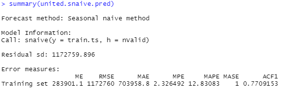
 
-	After comparing both these models we can say that Naive has lower RMSE and MAPE values and hence can be considered as a better model for forecasting future prediction.
-	The forecasting is applied on these models and results are shown below:

    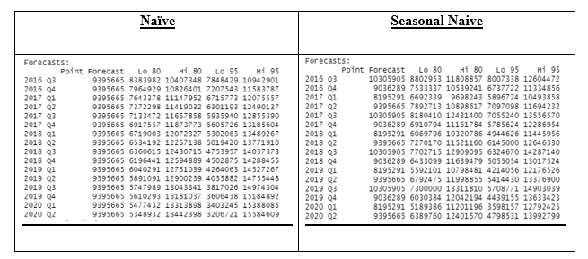	 

**Graphs:**
Shown below are the graphs of forecasting in Naïve and Seasonal Naïve model and it’s fit (over or under) in comparison with the original data.

   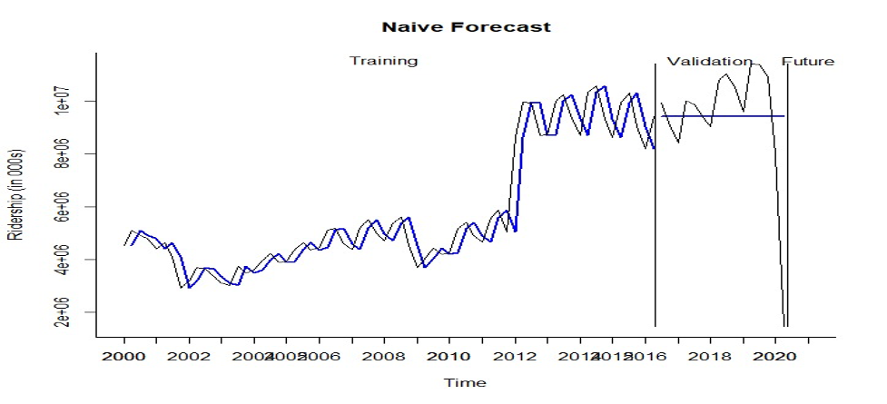

   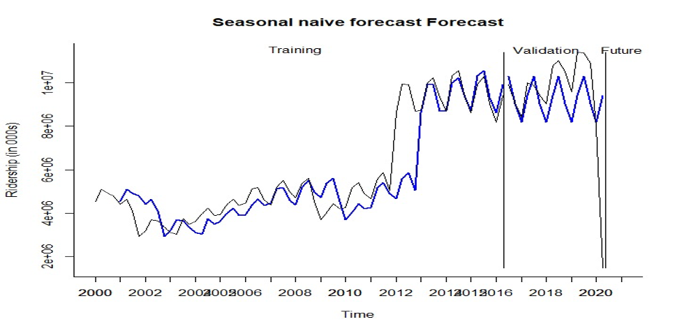
   
**Model 3: Two Level Model**

**Regression Model with Linear Trend and Seasonality:**

-	Shown below is the summary of Regression model with linear trend and seasonality, we have a total 3 seasons i.e., season 2,3 and 4 with trend component and an intercept. The p-value for all 2 seasons is higher than 0.1 and for season 4 it’s as huge as 0.9 which is close to 1. These values appear to be statistically insignificant, since all these values are insignificant, it might not be used for forecasting. The r-squared values are also not above 0.8 and are significantly low.

     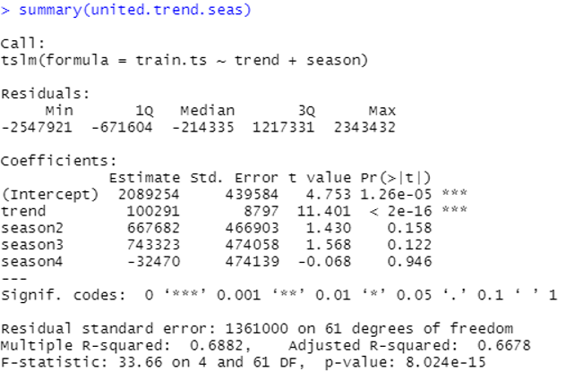
 
-	Equation for this model is: 
yt = 2089254 + 100291t + 667682D2 + 743323D3 – 32470D4
-	Forecasting based on linear trend and seasonality is shown below:

     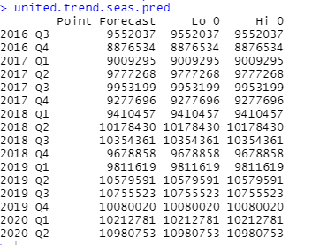
 
-	Displayed below is the residuals for time series based on the regression for linear trend and seasonality:

     
 

Trailing MA:
-	The trailing MA forecast for regression residuals is shown below:

     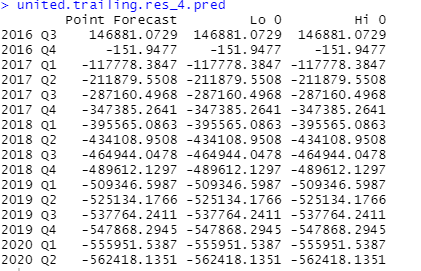
 
-	Shown below, we have created a combined table for forecasts of 
1.	Linear regression with trend and seasonality, 
2.	Residuals and 
3.	Two-level model (Combined model)

     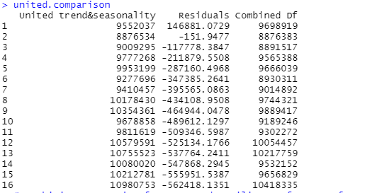
 
**Graphs:**
-	Shown below are the graphs for the Regression model with trend and Seasonality wherein we can see how the original data is compared with the performance of the regression model for trend and seasonality
-	There are certain regions of over and or underfitting at times. It is at times underpredicting the forecast.

     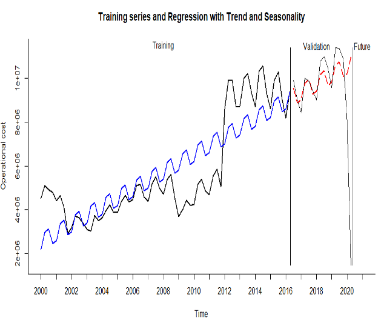
     
     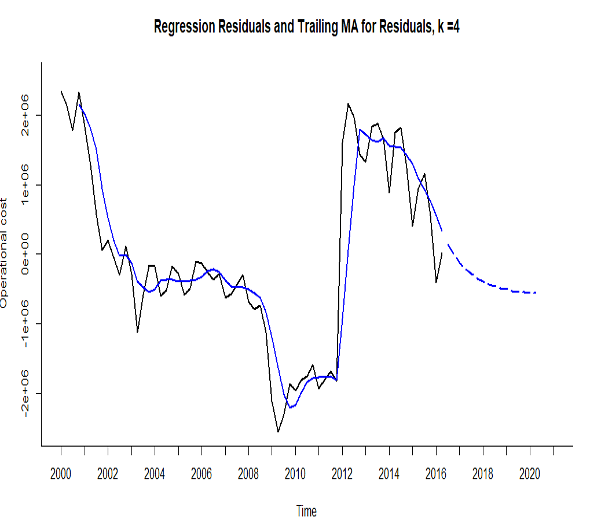
 
 
In the second graph, we have plotted the residuals for the trailing MA, with a window width of k=4.

**Regression Model with Quadratic trend and Seasonality:**

-	Shown below is the summary of Regression model with Quadratic trend and seasonality, we have a total of 3 seasons i.e., season 2, 3 and 4 with trend and trend^2 component and an intercept. The p-value for all 2 seasons is higher than 0.06 and 0.01 resp, for season 4 it’s as huge as 0.8 which is close to 1. The r-squared values are also above 0.8, which suggests it can be a good model.
-	Here, season 4 is statistically insignificant as the p value is greater than 0.5. But the overall model is statistically significant, hence can be used for forecasting. 

     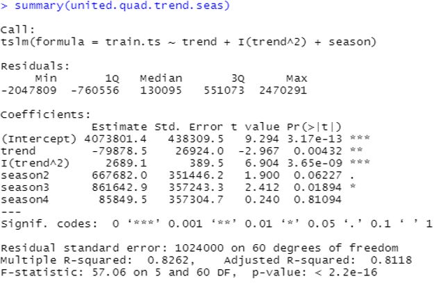

